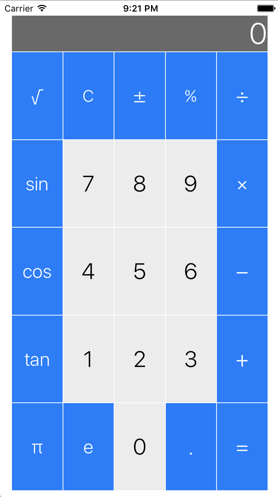
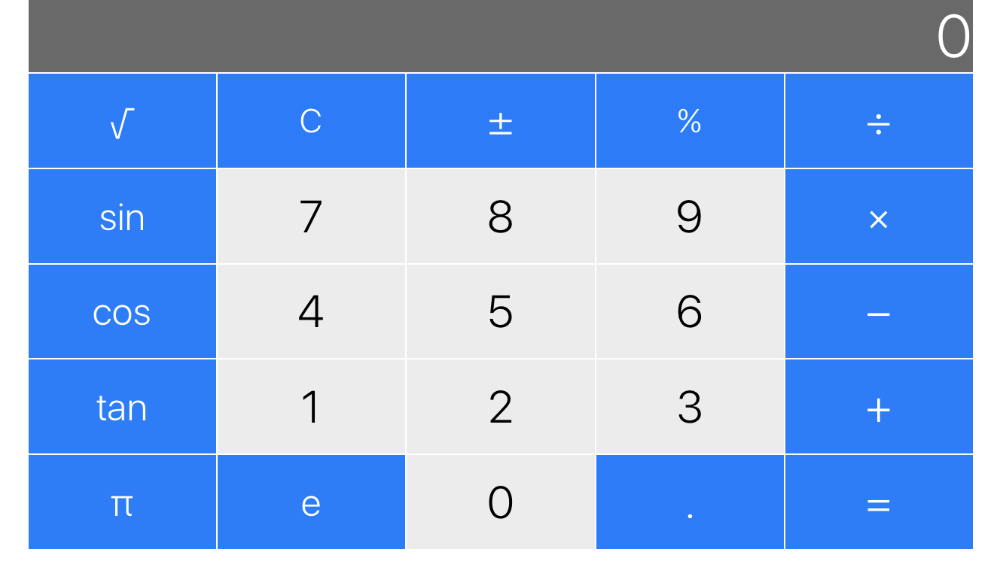

# Calculator
An iOS calculator app in Swift.

This app contains 13 mathematical operations including basic arithmetic, negation, percentage, square root, trig functions, and the constants π and e.

An introductory project in iOS development in which I learned about the MVC paradigm, the Swift language, Xcode, and how to develop responsive UI.

